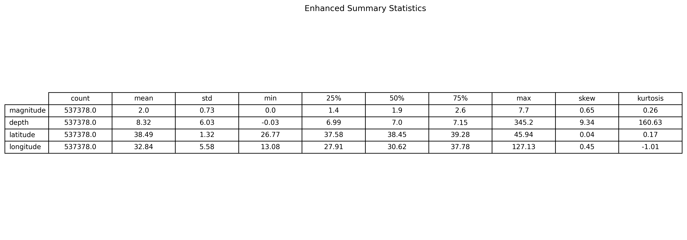
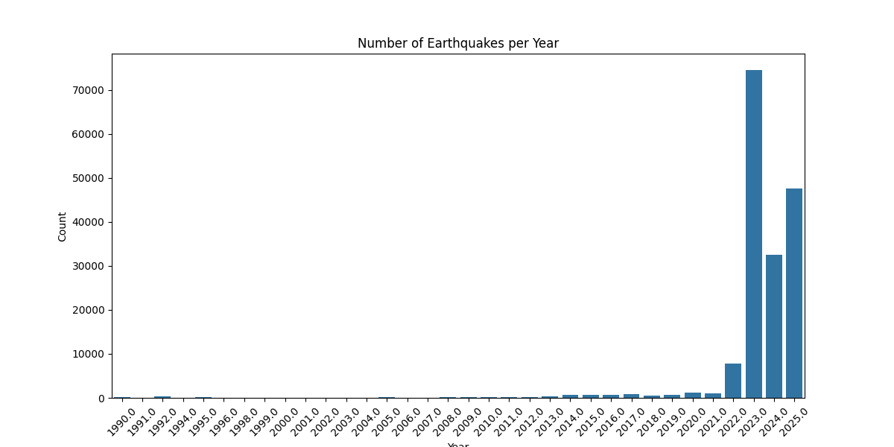
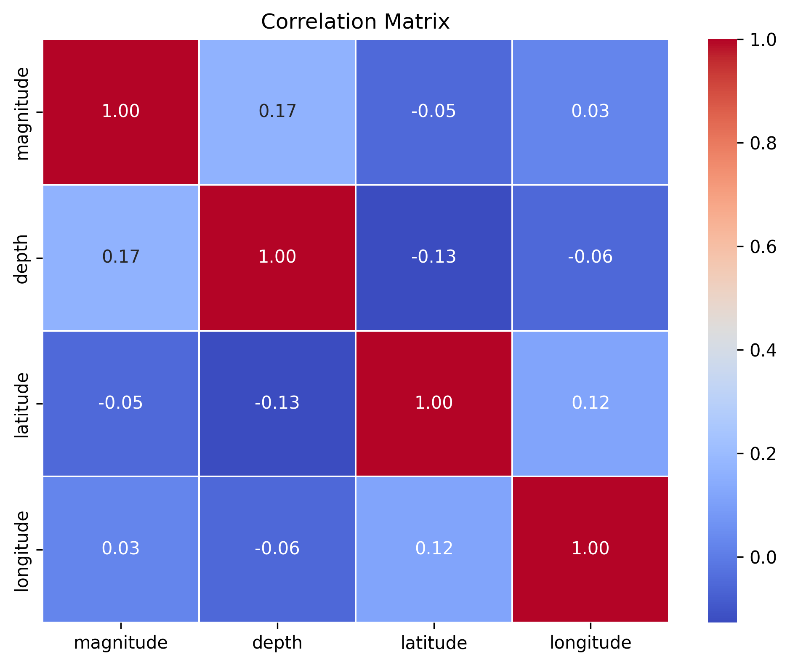
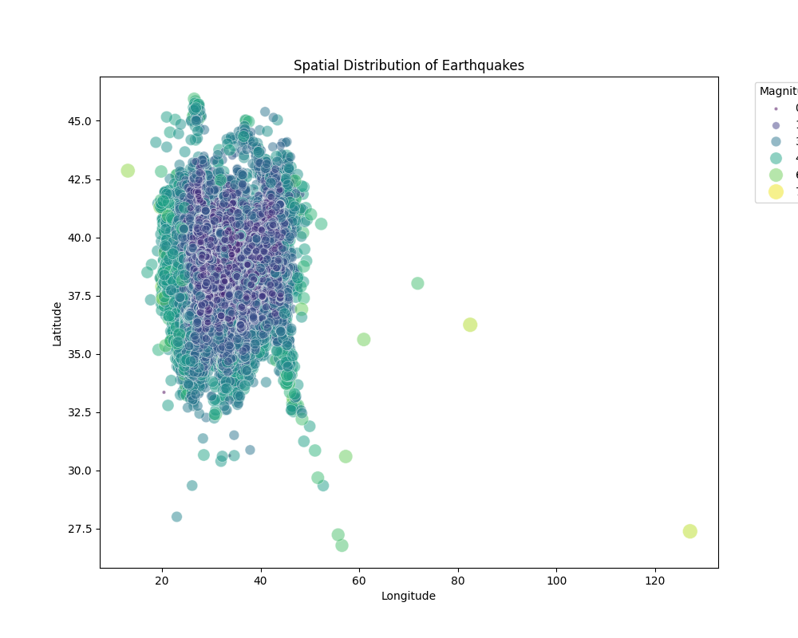

# EDA Walkthrough - AFAD Historical Data

I have performed an Exploratory Data Analysis (EDA) on the AFAD historical earthquake data (1990-2025). Here are the key findings and visualizations.

## Data Summary
- **Total Records**: 537,378 earthquakes
- **Time Range**: 1990 - 2025
- **Magnitude Range**: 0.0 - 7.7
- **Depth Range**: 0.0 - 82.8 km

- **Depth Range**: 0.0 - 82.8 km

### Data Information

### Data Sample (First 5 Rows)

### Summary Statistics

## Univariate Analysis

### Magnitude Distribution
The distribution of earthquake magnitudes shows that the vast majority of recorded earthquakes are of low magnitude.

### Depth Distribution
Most earthquakes occur at shallow depths.

### Temporal Distribution
The number of recorded earthquakes has increased over the years, likely due to improved detection networks.

## Multivariate Analysis

### Magnitude vs Depth
There doesn't appear to be a strong linear correlation between magnitude and depth, but larger earthquakes can occur at various depths.

### Correlation Analysis
The correlation matrix shows the relationships between numeric variables.

### Spatial Distribution
The spatial distribution plot clearly shows the major fault lines in Turkey.

